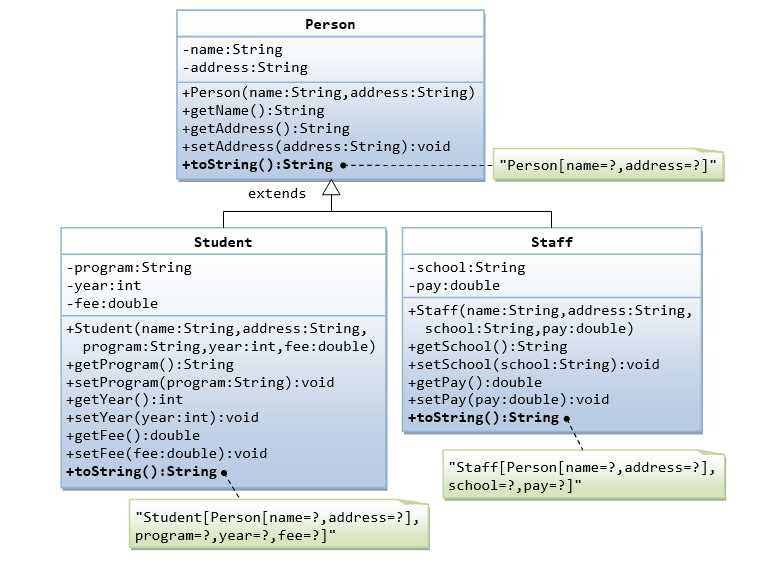

# OOP-inheritance-practice

Hozd létre az alábbi osztálystruktúrát!



A `Student` és a `Staff` osztályok származzanak le a `Person` osztályból, ezzel megörökölve annak
fieldjeit és metódusait! Ennek a kapcsolatnak a jelzése az UML osztálydiagramon a gyerekből a szülő
felé mutató teljes nyíl.

Továbbá érdemes tudni, hogy UML osztálydiagramokon a fieldek és a metódusok előtti
`-` a privát, a `+` a publikus és a `#` a protected láthatóságokat jelzi.

A három osztály (üresen) előre el lett készítve, az `src` mappában a `data` package-ben találhatóak.
A package-ek gyakorlatilag mappák, ezekben tudjuk rendszerezni a programunk osztályait.
Az osztályok be is lettek importálva a `Main` osztályba, ott tudod őket tesztelni.

A `toString()` metódusok felé most írd ki az `@Override` anntoációt!

```
@Override
public String toString() {
    return "TODO";
}
```